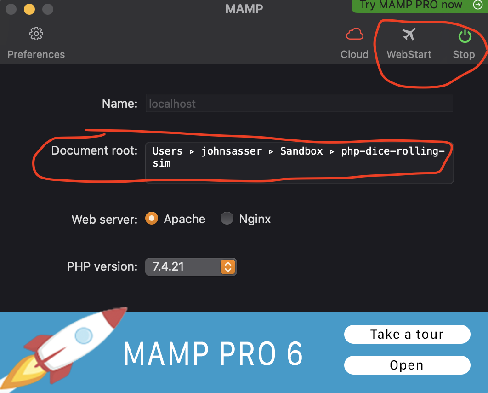

# php-dice-rolling-sim
php-dice-sim

Using the MAMP localhost connection to emulate the server.
 - downloaded to applications folder;
 - open and associate the correct Document root / filePath; 
 - run in top right
 - navigate to http://localhost:8888/index.php in the browser;

  

